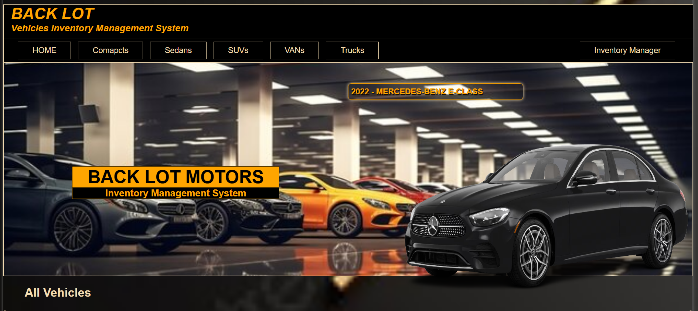
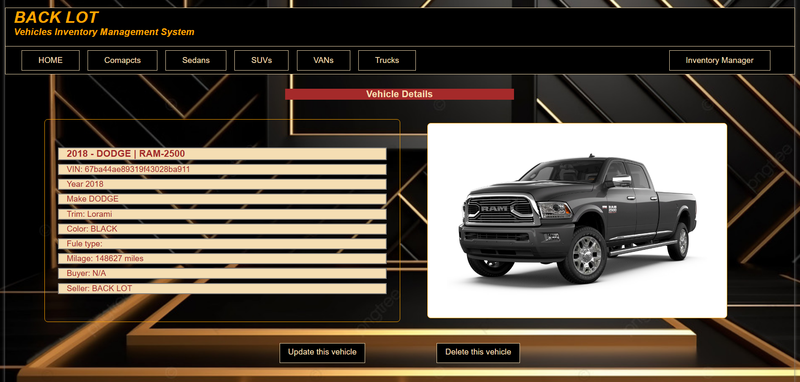

# BACK LOT - Invetory Management System

#### A full-stack web application for managing vehicle inventory

## Description
Back Lot is an inventory management system designed to help users manage a vehicle database efficiently. It allows adding, updating, deleting, and categorizing vehicles into different types such as compact, sedan, SUV, van, and truck.

## Table of Contents
* [Technologies Used](#technologiesused)
* [Features](#features)
* [Design](#design)
* [Project Next Steps](#nextsteps)
* [Deployed App](#deployment)
* [About the Author](#author)

## Technologies Used
* MongoDB
* Express
* React
* Nodejs
* JavaScript
* CSS3

## Features
[Users are able to...]
✅ View all vehicles in inventory  
✅ Categorized pages (Compact, Sedan, SUV, VAN, Truck)  
✅ Add, update, and delete vehicles  
✅ Responsive design with a hamburger menu  
✅ REST API for managing inventory  

## Wireframe Images
* 

## Trello Planning
* Link to trello or planning board - ex: https://trello.com/b/2jeHdFcV/project-1-connect-4

## Design
* Pages design has been developed using CSS 

## Project Next Steps
#### List of Future Features
* Application backend admistrator(s) will be able to create users accounts.
* Detailed customer page allows users from email/message customers.
* Proffesional Version Live bidding.
* History Database. Deleted/Removed vehicle informatin will be stored in another database for documentation.

## Deployed Link
[Render](https://backlot-inventory-management-system.onrender.com/)

* You can view the repository:
[Github.com](https://github.com/Alanimustafa/dot-auction-FR-end)
* If unable to view please go live locally through VS Code

## About The Author
I build applications and mini projects tied to my various interests. I look for creative solutions to real world problems and think of technical ways to address them. While no application is ever perfect I find joy in the process and all my final products!
[Developer LinkedIn](www.linkedin.com/in/mustafa-m-alani)
